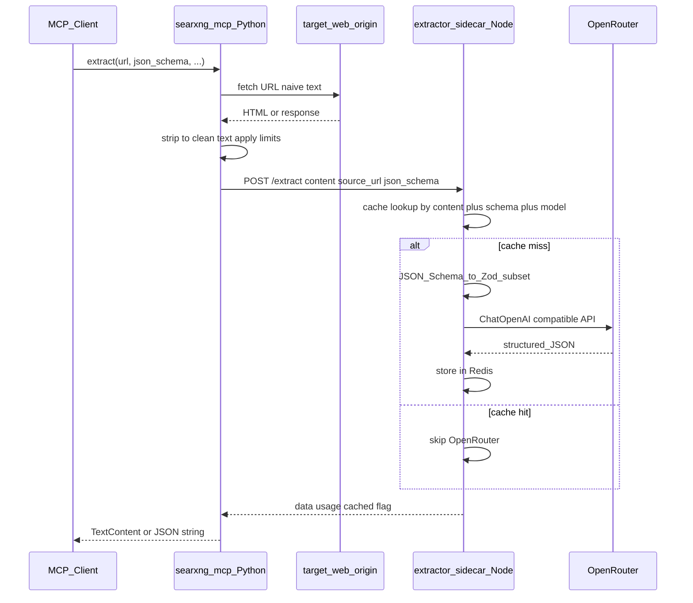

# Feature: MCP `extract` + Node extractor sidecar

## Problem Statement

Agents using the SearXNG suite can **search** and **fetch** web pages into naive clean text (`[mcp-server/server.py](../mcp-server/server.py)`), but many workflows need **structured fields** (titles, entities, citations, prices, etc.) derived from that text. Raw HTML stripping does not produce those structures.

**Desired end state:** A new `**extract`** capability that:

- Is the **only** tool the client uses for this flow: the client calls `**extract`** with a **URL** and `**json_schema`** (and optional parameters)—**not** a prior `fetch` then `extract`.
- **Internally**, the Python MCP **fetches** that URL using the same naive HTML→text path as the existing `**fetch`** tool (`[SearXNGClient.fetch](../mcp-server/server.py)`), then forwards the text + URL + schema to the sidecar.
- Performs **LLM-backed structured extraction** in an isolated **Node HTTP sidecar** using `[@lightfeed/extractor](https://github.com/lightfeed/extractor)`, with **OpenRouter** as the OpenAI-compatible API endpoint (LangChain `ChatOpenAI` with custom base URL).
- Keeps **Zod and OpenRouter keys** out of the MCP when the sidecar alone calls OpenRouter; the MCP still performs **HTTP fetch** to the target page (same trust/network model as `fetch`).

**Success criteria (product-level):**

- `extract` returns structured JSON matching a client-supplied **JSON Schema (v1 supported subset)** for typical article/page content.
- Failures (sidecar down, OpenRouter errors, invalid schema, oversized payload) are **explicit** and testable.
- **Repeated extracts** (same page + same extraction contract) do not repeatedly bill the LLM: **cached** successful extraction results with a clear policy (see § Caching).
- Deployment adds a **Compose service** on the existing Docker network (`searxng` in `[docker-compose.yml](../docker-compose.yml)`), using the existing **Redis** service (`[redis](../docker-compose.yml)`) for extract cache when enabled.

---

## Requirements

### Functional Requirements

- **MCP tool `extract`** (name fixed for v1):
  - **Feature flag (Python MCP):** `EXTRACT_ENABLED` — when **off** (default), the MCP **does not advertise** `extract` in `list_tools`, rejects `extract` in `call_tool` with a clear message, and the HTTP `POST /extract` route (if present) returns **404** or **503** with a stable JSON error body. When **on**, behavior below applies. This keeps minimal / sidecar-less stacks unchanged and avoids clients seeing a tool that always fails.
  - **Client inputs (MCP tool / HTTP body):** `url` (string, required)—page to fetch and extract from; `json_schema` (object, required)—JSON Schema describing the desired output shape (v1 **supported subset** only; see below); optional `prompt` (string) for extraction guidance; optional `content_format` (`markdown` | `txt` | `html`)—default `txt` to match current fetch output; optional `extraction_context` (object)—opaque key-value context forwarded to the sidecar for extractor’s `extractionContext` when applicable; optional `headers` (object)—custom headers for the **fetch** step (same idea as `[fetch](../mcp-server/server.py)`); optional `max_content_length` (integer)—cap on fetched text length before sidecar (same semantics as `fetch`, then subject to `EXTRACT_MAX_LENGTH`).
  - **Behavior:** (1) MCP **fetches** `url` using the same implementation path as `**fetch`** (naive clean text). (2) If fetch fails, return a clear error—**do not** call the sidecar. (3) Enforce `EXTRACT_MAX_LENGTH` on the fetched string (truncate or reject—document in implementation). (4) `POST` to the sidecar with body `{ content, source_url, json_schema, ... }` where `source_url` is the requested `url`. (5) Return sidecar **JSON** (or a stable text serialization of JSON) to the client—including cache hit metadata when applicable (see § Caching).
- **HTTP mirror (optional but recommended for parity):** `POST /extract` on the MCP HTTP server with the same body shape as the MCP tool, so non-MCP clients can call the same path as today for `/search`, `/fetch`, `/crawl`, `/health` (`[mcp-server/server.py](../mcp-server/server.py)`). Same `**EXTRACT_ENABLED`** gating as the MCP tool.
- **Sidecar HTTP API:**
  - `POST /extract`: body includes `content`, `source_url`, `json_schema`, optional fields above; **cache lookup** (if enabled); on miss, validates schema subset; converts JSON Schema → **Zod**; calls `@lightfeed/extractor` `extract()` with `ContentFormat` aligned to `content_format`; **store** successful results in cache; returns `{ data, usage, processedContent?, cached?: boolean }` (or equivalent) as in extractor’s documented result shape plus cache metadata.
  - `GET /health`: liveness for Compose healthchecks.
- **Secrets:** OpenRouter API key and model configuration **only** on the sidecar (or build-time env for the sidecar image), not required on `searxng-mcp` if the MCP only proxies over HTTP.

### Technical Constraints

- **Stack:** Docker Compose; new sidecar service (working name TBD, e.g. `extractor-sidecar`) on network `searxng` (`[docker-compose.yml](../docker-compose.yml)`).
- **MCP → sidecar:** Configurable `EXTRACTOR_SIDECAR_URL` (e.g. `http://extractor-sidecar:3000`) on `searxng-mcp`; internal DNS only; no public exposure required.
- **OpenRouter:** LangChain JS `ChatOpenAI` with `baseURL` set to OpenRouter’s OpenAI-compatible API (e.g. `https://openrouter.ai/api/v1`); model id via env (e.g. `OPENROUTER_MODEL`); optional headers per OpenRouter (`HTTP-Referer`, `X-Title`) for attribution.
- **Extract limits (env-backed, mandatory in implementation):** Timeout and max content length **must not** reuse the MCP’s generic `DEFAULT_TIMEOUT` (5s) used for SearXNG/fetch—LLM and sidecar hops need separate knobs. Implement **environment variables with defaults** on both `searxng-mcp` and the sidecar (defense in depth: MCP rejects before send; sidecar rejects oversized requests before OpenRouter).

| Variable             | Where                     | Meaning                                                                                                                               | Default          |
| -------------------- | ------------------------- | ------------------------------------------------------------------------------------------------------------------------------------- | ---------------- |
| `EXTRACT_ENABLED`    | `searxng-mcp`             | Enable `extract` tool and HTTP `/extract`; use common truthy/falsy parsing (`1`, `true`, `yes` / `0`, `false`, `no`, unset)           | `false` (opt-in) |
| `EXTRACT_TIMEOUT`    | `searxng-mcp`             | HTTP client timeout **(seconds)** for `POST` to the sidecar (entire request–response, including sidecar’s OpenRouter work)            | `120`            |
| `EXTRACT_MAX_LENGTH` | `searxng-mcp` and sidecar | Maximum length of the `content` string (Unicode code units / Python `len`-style character count); reject with clear error if exceeded | `524288` (512 KiB) |

- **Optional (v1+):** `EXTRACT_MAX_JSON_BODY_BYTES` — cap on raw POST body size (e.g. default `524288` / 512 KiB) to bound `json_schema` + metadata + `content`; if unset, derive a conservative cap from `EXTRACT_MAX_LENGTH` + overhead in implementation docs.
- **Sidecar → OpenRouter:** Sidecar should use a timeout **≥** the MCP→sidecar budget or an explicit separate env (e.g. `EXTRACT_OPENROUTER_TIMEOUT_MS`) so the sidecar fails predictably before the MCP client times out; document ordering in implementation.
- **Optional `maxInputTokens`:** Passed through to extractor when supported; subordinate to `EXTRACT_MAX_LENGTH` (truncate or reject per implementation note).
- **Note:** `EXTRACT_MAX_LENGTH` (512 KiB by default) is intentionally **stricter** than `[server.py](../mcp-server/server.py)` `MAX_FETCH_CONTENT_LIMIT` (1 MiB); the MCP applies this limit **after** fetch and **before** the sidecar (truncate or reject—document in implementation), or raise the env override.
- **Compatibility:** v1 commits to **JSON Schema subset → Zod** (stakeholder decision); unsupported schema features **rejected with HTTP 400** and a clear error message from the sidecar.

### Caching (LLM result cache)

**Goal:** Avoid repeat OpenRouter calls when the **inputs to extraction are equivalent**, since LLM usage is the dominant cost.

**Where:** Implement the cache in the **extractor sidecar** (the component that invokes the LLM). The MCP continues to **fetch on every `extract` request** unless a separate fetch-cache is added later; **caching targets the LLM step** after fetch.

**Backend:** Use the existing **Redis** service on the `searxng` network (`[docker-compose.yml](../docker-compose.yml)` `redis`). The sidecar connects via `**REDIS_URL`** (or equivalent), e.g. `redis://redis:6379/0` (Compose **service** hostname on `searxng` network) with a dedicated key prefix (e.g. `extract:`). If Redis is unavailable and caching is enabled, **degrade gracefully**: skip cache, call the LLM (log warning)—do not fail the request solely due to cache outage.

**Cache key (deterministic):** A stable hash over the concatenation or structured tuple of:

- **Model id** used for OpenRouter (from env, e.g. `OPENROUTER_MODEL`).
- **Canonical JSON** of `json_schema` (sorted keys, stable serialization).
- `**prompt`** string (or empty).
- `**content_format**`.
- **Canonical JSON** of `extraction_context` if present (sorted keys).
- `**sha256`** (or SHA-256 hex) of the **fetched `content`** string **after** the same normalization the sidecar uses for extraction (post–`EXTRACT_MAX_LENGTH` truncation). Including **content** in the key ensures a page update yields a cache miss without relying only on URL.

**Value:** Serialize the successful sidecar response payload (at minimum `data` and fields needed to reconstruct the client-visible JSON; optionally omit or zero `usage` on cache hits or mark as cached).

**TTL:** Env `**EXTRACT_CACHE_TTL_SECONDS`** on the sidecar (default e.g. `**86400**` / 24 hours). Keys expire automatically; no manual invalidation required for v1.

**Enable flag:** Env `**EXTRACT_CACHE_ENABLED`** on the sidecar—truthy/falsy parsing; default `**true**` when `REDIS_URL` is set, `**false**` when unset (developer local runs without Redis). Alternatively default `**false**` for opt-in—**pick one in implementation and document**; recommended default `**true`** in production Compose with Redis wired.

| Variable                    | Where   | Meaning                              | Default                                                                    |
| --------------------------- | ------- | ------------------------------------ | -------------------------------------------------------------------------- |
| `EXTRACT_CACHE_ENABLED`     | Sidecar | Enable Redis-backed LLM result cache | `true` if `REDIS_URL` set, else `false` (recommended; document exact rule) |
| `EXTRACT_CACHE_TTL_SECONDS` | Sidecar | TTL for cache entries                | `86400`                                                                    |
| `REDIS_URL`                 | Sidecar | Redis connection string              | Unset in dev; `redis://redis:6379/0` (or DB index per policy) in Compose   |

**Client-visible behavior:** Responses should include a boolean such as `**cached: true`** on hits so operators and agents can tell cost/latency expectations.

**Privacy:** Cached entries may contain **PII** derived from page content; Redis persistence is already configured in Compose—document that extract cache shares the same data-class considerations as logging page text to a third-party LLM.

**Redis container: heavy single-user profile (implementation / Compose tuning):** The stack today runs a **single shared** `redis` service (`[docker-compose.yml](../docker-compose.yml)`: `redis-server --save 30 1`, volume-backed persistence). For **one primary user** driving **high extract volume** (large JSON payloads, many distinct keys), tune Redis so cache growth does not **OOM the host** or thrash disk with unnecessary persistence.

| Concern                        | Recommendation                                                                                                                                                                                                                                                                                                                                                                                                                                                                           |
| ------------------------------ | ---------------------------------------------------------------------------------------------------------------------------------------------------------------------------------------------------------------------------------------------------------------------------------------------------------------------------------------------------------------------------------------------------------------------------------------------------------------------------------------- |
| **Isolation**                  | Use a **dedicated logical DB** in `REDIS_URL` (e.g. `/1` instead of `/0`) for `extract:` keys so other future consumers of the same Redis instance do not share keyspace; document the index in deployment notes.                                                                                                                                                                                                                                                                        |
| **Memory bound**               | Set `**maxmemory`** (e.g. `512mb`–`2gb` depending on host) and `**maxmemory-policy**` `**volatile-lru**` (all extract keys use TTL, so eviction prefers keys near expiry under pressure). Alternative: `**allkeys-lru**` if any long-lived keys without TTL are stored in the same DB.                                                                                                                                                                                                   |
| **Docker**                     | Optionally set `**mem_limit`** (or Compose `deploy.resources.limits.memory`) on the `redis` service so the container cannot consume unbounded RAM on a workstation.                                                                                                                                                                                                                                                                                                                      |
| **Persistence vs cache churn** | Extract cache is **disposable** (can be rebuilt by re-calling the LLM). For **heavy** single-user caching, prefer **lower persistence cost**: e.g. keep RDB with a **less frequent** save schedule than `30 1` if acceptable, or document `**appendonly no`** for a cache-only Redis dedicated to extract (trade-off: less durability on crash). Do **not** weaken persistence if the same Redis volume is relied on for non-cache data—**split services** or DB index separation first. |
| **Connections**                | Single sidecar → Redis is low connection count; ensure `**timeout`** and client **connection pooling** in the sidecar match expected concurrency (mostly sequential per user).                                                                                                                                                                                                                                                                                                           |
| **Monitoring**                 | Expose or log `**INFO memory`** / `**dbsize**` periodically in ops docs; watch **evicted_keys** if `maxmemory` is set—rising evictions mean TTL+policy are working but capacity may be tight.                                                                                                                                                                                                                                                                                            |

These are **deployment recommendations** for the spec; actual `command:` / `sysctl` / Compose changes belong in the implementation phase and should be validated on the target host.

### Edge Cases & Error Handling

| Scenario                                           | Expected behavior                                                                                  |
| -------------------------------------------------- | -------------------------------------------------------------------------------------------------- |
| Sidecar unreachable                                | MCP returns error text; HTTP 502/503 mapping as documented                                         |
| OpenRouter 4xx/5xx                                 | Sidecar returns structured error; MCP forwards to client                                           |
| `json_schema` uses unsupported keywords            | Sidecar 400 with reason; MCP surfaces message                                                      |
| JSON Schema → Zod conversion failure               | Sidecar 400; no partial LLM call                                                                   |
| Fetch fails (network, HTTP error, etc.)            | MCP returns error; sidecar not called                                                              |
| Fetched text empty or whitespace-only              | MCP or sidecar rejects with clear error; document in implementation                                |
| Payload over size limit                            | MCP or sidecar rejects before LLM call using `EXTRACT_MAX_LENGTH` (and optional body cap); 413/400 |
| Model returns invalid JSON (extractor mitigations) | Rely on extractor + Zod; document recovery behavior                                                |
| `EXTRACT_ENABLED` is off                           | `extract` not listed; direct tool/HTTP calls get a clear “extract disabled” response               |
| Redis unavailable; cache enabled                   | Degrade: perform LLM extraction without cache; do not fail solely on Redis errors                  |
| Same URL + schema, page content unchanged          | Cache hit: no OpenRouter call; response includes `cached: true`                                    |

---

## Technical Approach

### Implementation Strategy

1. **Sidecar (Node):** Dockerfile + `package.json` with `@lightfeed/extractor`, `@langchain/openai`, `zod` (peer/dependency per extractor); implement `POST /extract` and `GET /health`; **Redis-backed LLM result cache** (§ Caching); implement **JSON Schema (subset) → Zod** (library choice or hand-rolled for the subset—see § JSON Schema subset).
2. **MCP (Python):** Gate `extract` on `EXTRACT_ENABLED`; add `extract` to `list_tools()` / `call_tool` only when enabled; implement `handle_extract_tool`: **fetch `url` via existing client** (same as `fetch`), apply length limits, then `POST` JSON to `EXTRACTOR_SIDECAR_URL/extract` using `urllib` or `aiohttp` (match existing style in `[server.py](../mcp-server/server.py)`); optionally add `extract_endpoint` route mirroring other endpoints (same gate).
3. **Compose:** New sidecar service, `depends_on` **redis** (and other deps) / `healthcheck` as needed; `searxng-mcp` `environment` includes `EXTRACT_ENABLED=true` when the stack includes the sidecar, plus `EXTRACTOR_SIDECAR_URL`, `EXTRACT_TIMEOUT`, and `EXTRACT_MAX_LENGTH` (optional overrides); sidecar `environment` includes OpenRouter variables, `EXTRACT_MAX_LENGTH`, `**REDIS_URL`**, `**EXTRACT_CACHE_ENABLED**`, `**EXTRACT_CACHE_TTL_SECONDS**` (optional overrides).
4. **Documentation:** Update `[mcp-server/README.md](../mcp-server/README.md)`, root `[README.md](../README.md)`, and `[API_DOCUMENTATION.md](../API_DOCUMENTATION.md)` if the HTTP surface is extended.

### Architecture

- **MCP role:** **Fetch** the URL (same behavior as `fetch`); validate size/timeouts; forward naive text + `**source_url`** + **JSON Schema** + optional **prompt** / **content_format** / **extraction_context**; **no Zod in Python**.
- **Sidecar role:** OpenRouter credentials; **Redis LLM cache** (§ Caching); run `extract({ llm, content, format, schema: zodSchema, ... })` on miss; return structured result, usage, and **cache hit** metadata.

### JSON Schema subset (v1) and Zod mapping

The sidecar **must** document and enforce a **supported subset** of JSON Schema Draft 2020-12 (or a fixed earlier draft) for `json_schema`:

- **Allowed:** `type` (`object`, `string`, `number`, `integer`, `boolean`, `array`); `properties` for objects; `required` array; `items` for arrays; `description` on properties (maps to Zod `.describe()`); nullable fields via `**type: ["string", "null"]`** or explicit `nullable: true` (choose one convention for v1 and document it).
- **Explicitly unsupported / rejected (v1):** `$ref`, `allOf`/`anyOf`/`oneOf`/`not`, `$defs`, conditional schemas, regex `pattern` (unless later added), numeric `minimum`/`maximum` (unless mapped), `additionalProperties` (default: reject or treat as strict false—document choice).
- **OpenAI / extractor note:** Per extractor docs, OpenAI models may require `**.nullable()`** instead of `**.optional()**` for some fields; the conversion layer should apply **one consistent rule** for optional vs nullable and document it.

**Mapping layer:** Either a **small hand-rolled** recursive builder for the subset only, or a **dependency** that can generate Zod from JSON Schema with **strict subset validation**—implementation choice recorded in the implementation phase.

### Client workflow (single tool)

- **Primary flow:** The client calls `**extract`** only, with `**url**` + `**json_schema**` (and optional parameters). The MCP performs the **fetch** step internally; the client does **not** call `**fetch`** first and does **not** pass pre-fetched `content` in v1.
- **Standalone `fetch`:** The existing `**fetch`** tool remains available for debugging, inspection, or workflows that only need naive text without structured extraction (`[handle_fetch_tool](../mcp-server/server.py)`). It is **not** part of the `extract` user journey.

**Optional (future):** An advanced parameter or separate tool to accept **raw `content`** + `source_url` without an MCP-side fetch (e.g. for content obtained elsewhere). **Out of scope for v1** unless added explicitly.

### Affected Components

| File / area                                       | Change                                                                                                                                                                                                                       |
| ------------------------------------------------- | ---------------------------------------------------------------------------------------------------------------------------------------------------------------------------------------------------------------------------- |
| `[docker-compose.yml](../docker-compose.yml)`     | New sidecar service; `**redis`** linked for cache (`REDIS_URL`); env vars on `searxng-mcp` and sidecar                                                                                                                       |
| `[mcp-server/server.py](../mcp-server/server.py)` | `EXTRACT_ENABLED` gate; `extract` tool + handler when on (internal fetch + sidecar POST); optional `/extract` route; read `EXTRACTOR_SIDECAR_URL`, `EXTRACT_TIMEOUT`, `EXTRACT_MAX_LENGTH` from env with documented defaults |
| New `extractor-sidecar/` (or similar)             | Node app, Dockerfile, package manifest                                                                                                                                                                                       |
| `[mcp-server/README.md](../mcp-server/README.md)` | `extract` tool + env vars; optional curl example                                                                                                                                                                             |
| `[README.md](../README.md)`                       | High-level overview of extract + sidecar                                                                                                                                                                                     |
| `[API_DOCUMENTATION.md](../API_DOCUMENTATION.md)` | If HTTP `/extract` is exposed, document request/response                                                                                                                                                                     |

### Dependencies & Integration

- **External:** OpenRouter (HTTPS); SearXNG unchanged.
- **Internal:** `searxng-mcp` → `extractor-sidecar` HTTP; sidecar → **Redis** (cache); existing `redis` container on `searxng` network.
- **Libraries (sidecar):** `@lightfeed/extractor`, `@langchain/openai`, `zod`; Redis client (e.g. `ioredis` or `redis`); LangChain peer dependency per extractor docs.

---

## Acceptance Criteria

- `extract` MCP tool appears in `list_tools` with documented `inputSchema` (`url`, `json_schema`, optional fields)—**not** a two-step `fetch` + `extract` for the client.
- Successful path: minimal valid JSON Schema subset produces **structured `data`** matching intent in manual tests (with real OpenRouter key in integration environment).
- **Second identical request** (same fetched content + schema + model + prompt) returns a **cache hit** (`cached: true`) without a duplicate OpenRouter charge (verified via mock or billing/logs).
- Sidecar `GET /health` returns 200 when ready; Compose healthcheck can use it.
- Unsupported `json_schema` returns **400** with a clear message from the sidecar; MCP surfaces it without crashing.
- Sidecar/OpenRouter failure returns a **non-success** response; MCP does not leak OpenRouter secrets.
- `EXTRACT_ENABLED` defaults off; when on, `extract` appears in `list_tools` and works end-to-end; when off, tool is absent and calls fail clearly.
- `EXTRACT_TIMEOUT` and `EXTRACT_MAX_LENGTH` are read from the environment with defaults `120` and `524288`; behavior is verified when unset.
- Payload size limits are enforced (`EXTRACT_MAX_LENGTH` and optional total-body cap); documented relationship to fetch’s 1 MiB cap (extract stricter unless env overridden).

---

## Implementation Tasks

- Add `extractor-sidecar` Node service + Dockerfile + OpenRouter env configuration + **Redis** cache client and key/TTL logic.
- Implement JSON Schema subset validation and **Zod** generation; wire `extract()` from `@lightfeed/extractor`.
- Add `EXTRACT_ENABLED` parsing and gating; MCP `extract` handler that **fetches `url` then** POSTs to `EXTRACTOR_SIDECAR_URL`; optional HTTP `/extract` with the same gate.
- Extend Compose and env examples; document in README.
- Tests: unit tests for schema conversion and **cache key** stability; integration tests with Redis + mocked OpenRouter on second call; MCP tests with mocked sidecar.

---

## Risk Assessment

### Potential Issues

| Risk                                    | Impact                                                                                              |
| --------------------------------------- | --------------------------------------------------------------------------------------------------- |
| **Token cost / latency**                | High usage or large `content` increases cost and time; **mitigated by cache** for repeated extracts |
| **Stale cache**                         | TTL + content hash in key; same URL with changed page content yields new hash → miss                |
| **Redis memory / eviction**             | Large payloads; monitor Redis memory; tune TTL and maxmemory policy if needed                       |
| **PII / sensitive page text**           | Content sent to OpenRouter; compliance depends on deployment                                        |
| **JSON Schema ↔ Zod bugs**              | Subtle validation or LLM prompt mismatches                                                          |
| **OpenRouter model variance**           | Different models may need different optional/nullable handling                                      |
| **Extractor + LangChain version drift** | Lock versions in sidecar `package.json`                                                             |

### Mitigation Strategies

- Enforce **max content length** and **timeouts**; optional `maxInputTokens` in extractor options.
- Document **data flow** (text leaves boundary at sidecar → OpenRouter); restrict network egress if needed.
- **Strict subset** for v1; comprehensive tests for conversion; reject unknown keywords.
- **Pin** model id and document recommended models for extraction.
- **Cache** includes model id in key so model changes do not return wrong structured data.
- **Lockfile** (`package-lock.json` / `pnpm-lock.yaml`) in the sidecar image.

### Investigation Requirements

- **Prototype** JSON Schema subset → Zod for nested objects + arrays of objects (common use case).
- **Confirm** LangChain `ChatOpenAI` options for OpenRouter (base URL + default headers) against current `@langchain/openai` version.

---

## References

- [@lightfeed/extractor README](https://github.com/lightfeed/extractor) — `extract()`, `ContentFormat`, `ChatOpenAI`, optional OpenAI nullable note.
- [OpenRouter API](https://openrouter.ai/docs) — base URL, headers, model IDs.
- Existing MCP: `[mcp-server/server.py](../mcp-server/server.py)` — `fetch` (shared fetch path with `extract`), limits, HTTP endpoints.

